### 탐색 트리

####레드블랙트리Red-Black Tree

레드블랙트리는 노드에 색을 부여하여 트리의 균형을 유지하여, 균형이진트리이다.  
또한 균형 유지로 인해 탐색, 삽입, 삭제 연산의 수행시간이 각각 $O(\log N)$을 넘지 않는 자료구조이다.

레드블랙트리는 삽입이나 삭제 연산을 할 때,  
트리의 균형을 유지하기 위해 상당히 많은 경우를 고려해야 한다는 단점이 있다.  
이로 인해 프로그램이 복잡해지고, 그 길이도 길어진다.

레드블랙트리의 기본성질은 다음과 같다.
1. 기본적으로 이진탐색트리의 성질을 따른다.
2. 각 노드는 레드 또는 블랙 둘 중 하나이다.
3. 루트 노드는 블랙이다.
4. 모든 이파리 노드(NIL)은 블랙이다.
5. 노드가 레드이면, 그 노드의 자식노드는 모두 블랙이다.
   (레드 노드는 연속으로 나올 수 없다.)
6. 루트노드로부터 각 이파리 노드까지의 경로에 있는 블랙 노드의 개수는 같다 (균형이진트리)

노드의 블랙 깊이Black Depth는
루트에서 특정 노드까지의 블랙 노드의 개수로 정의된다.

그와 동시에 블랙 높이Black Height은  
어떤 루트에서부터 이파리 노드(NIL)까지의 경로에 존재하는 블랙 노드들의 수를 말한다.  
즉, 성질 6번의 블랙 노드의 개수가 black height다.

여기서 실제 구현에서는 이파리 노드(NIL)을 모로 든 노드에 할당하는 방법도 있지만,  
하나의 노드를 할당하여 이를 이파리 노드(NIL)로 정하고,  
이파리 노드를 필요로 하는 노드들은 하나의 노드만 레퍼런스하면 된다.

#####레드블랙트리에서의 높이

노드 $x$의 높이 $h(x)$는  
자신으로부터 이파리 노드까지의 가징 긴 경로에 포함된 간선의 개수이다.

노드 $x$의 높이 $bh(x)$는  
$x$로부터 이파리 노드까지의 경로 상의 블랙 노드의 개수이다. (노드 $x$ 불포함)

높이가 $h$인 노드의 블랙 높이는 위의 성질 5번에 의해  
레드 노드가 연속될 수 없으므로, $bh \ge {h \over 2}$이다.

노드 $x$를 루트로 하는 임의의 서브트리는 적어도 $2^{bh(x)}-1$개의 내부노드를 포함한다.

n개의 내부노드를 가지는 레드블랙의 높이는 $2\log_2 n+1$이다.  
($n \ge 2^{bh(x)}-1 \ge 2^{h\over2}-1$이므로)

#####레드블랙트리에서의 검색

레드블랙트리에서의 검색은 트리의 내용을 수정하지 않으므로,  
이진검색트리에서의 검색과 동일하다.

기본적으로 탐색은 중위순회를 기본으로 한다.

#####레드블랙트리에서의 삽입

수정이 일어나지 않는 탐색과 다르게 ,삽입이나 삭제와 같은 수정이 일어나는 경우에는,  
기본적으로는 이진검색트리와 동일하지만, 연산 이후 트리의 성질을 위반하는 경우가 발생한다.

노드를 삽입할 때는 먼저 이진검색트리의 삽입 알고리즘에 따라 삽입을 한 다음,  
새 노드의 색상을 **레드**로 칠한다. 이 노드를 $z$라고 하자.

새 노드는 항상 맨 아래 쪽에 매달리므로, 삽입 직후에 $z$의 아래 쪽은  
블랙 노드인 이파리 노드 두 개만이 있으므로 트리의 성질을 위반하지 않는다.

하지만 $z$가 루트 노드이면서 레드이거나, $z$와 그 부모노드 $p_z$가 둘 다 레드인 경우 위반이 일어난다.

이를 해결하기 위해서는 부모노드 $p_z$가 블랙이 되거나,  
$z$가 루트인 경우 $z$를 블랙으로 바꿔주면 해결된다.

그렇지만 노드의 색을 바꿔주는 것만으로는 완벽하게 해결되지는 않는다.  
왜냐하면, 삽입된 노드의 색, 부모노드의 색뿐만 아니라,  
그 부모노드의 부모노드와 삽입된 노드의 삼촌 노드, 즉 부모노드의 형제노드의 색까지  
삽입이 영향을 끼칠 수 있기 때문이다.

따라서 크게 두 가지 case에 따라 해결할 수 있다.  
1. 부모 노드가 레드이고, 부모의 형제가 블랙인 경우 -> 회전
2. 부모 노드가 레드이고, 부모의 형제가 레드인 경우 -> 색 변환

그렇지만, 노드의 삽입 순서에 따라 위의 case들을 설명하겠다.

1. 루트 노드로 삽입

새 노드의 삽입은 무조건 레드로 삽입되지만,  
루트노드는 무조건 블랙 노드이므로, 삽입된 노드는 블랙 노드로 저장된다.

2. 부모 $P$가 블랙인 경우

그 다음 새로 삽입되는 노드는 루트노드에 삽입되지 않기 때문에,  
루트노드의 자식노드로, 레드 색상을 지닌 채로 저장된다.  
이 경우에는 트리는 아직 유효한 상태이다.

루트노드의 자식 노드들이 모두 다 삽입되고 나면,  
이후에는 속성의 위반이 발생하게 된다.  
즉, 연속된 레드 노드가 생기게 되는 것이다.

이 경우 두 가지 경우가 발생할 수 있는데,  
3, 4번이 그 예이다.

3. 부모가 레드, 삼촌도 레드

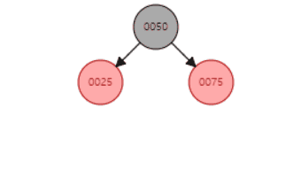  
노드가 삽입되었을 때, 그 노드의 부모가 레드인 경우에 속성의 위반이 발생하게 된다.

부모가 레드인 경우에는 반드시 할아버지는 블랙이어야 한다. (기존 트리가 속성을 만족했기 때문)  
그리고 삼촌노드 또한 레드라면,  
부모와 삼촌의 색상을 블랙으로 바꾸고 할아버지의 색상을 레드로 바꾼다.

새로 생긴 레드 노드인 할아버지 노드는 새로 삽입된 노드로 생각하여  
상위 트리에 대해 지금 적용한 처리 알고리즘을 재귀적으로 적용할 수 있다.  
(할아버지의 부모 노드를 블랙으로, 할아버지의 할아버지 노드를 레드로 ...)

만약 할아버지 노드가 루트 노드라면,  
할아버지 노드를 다시 블랙으로 바꾸면 된다.  
이 경우에는 루트노드 다음에 바로 블랙 노드가 바로 오게 되며,  
기존의 black height에서 1만큼 더 증가하게 된다.  
(기존 : B-R-B-R-B... / 이후 : B-B-R-B-R...)

4. 부모가 레드, 삼촌은 블랙  

이 경우부터 세부적으로 경우의 수가 많아진다.  

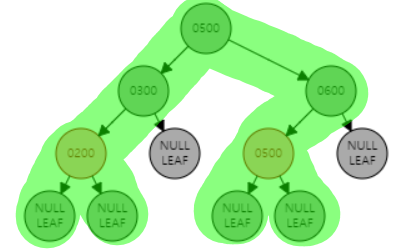  
다음은 삽입된 노드의 부모노드가 할아버지 노드의 왼쪽 자식노드인 경우에만 해당된다.

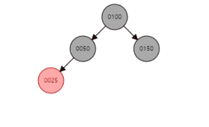  
**4L-a** 삽입된 노드가 부모의 왼쪽 자식인 경우  
할아버지 노드를 중심으로 오른쪽 회전을 실시하고,  
할아버지 노드와 부모 노드의 색상을 서로 바꾼다.

   
**4L-b** 삽입된 노드가 부모의 오른쪽 자식인 경우  
부모 노드를 중심으로 왼쪽 회전을 실시한다.  
회전 이후에도 트리의 특성을 위반하지만 **4L-a** 상황과 동일하다.  
따라서 **4L-a** 상황의 알고리즘을 실시한다.

반대의 경우에는 위의 설명과 반대되는 회전연산을 실시하면 된다.  
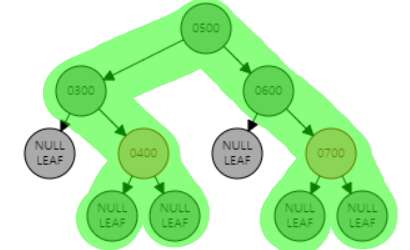  
즉 삽입된 노드의 부모노드가 할아버지 노드의 오른쪽 자식노드인 경우에만 해당된다.

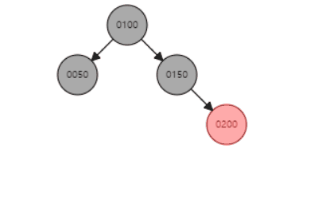  
**4R-a** 삽입된 노드가 부모의 오른쪽 자식인 경우  
할아버지 노드를 중심으로 왼쪽 회전을 실시하고,  
할아버지 노드와 부모 노드의 색상을 서로 바꾼다.

  
**4R-b** 삽입된 노드가 부모의 왼쪽 자식인 경우  
부모 노드를 중심으로 오른쪽 회전을 실시한다.  
회전 이후에도 트리의 특성을 위반하지만, **4R-a** 상황과 동일하다.  
따라서 **4R-a** 상황의 알고리즘을 실시한다.

#####레드블랙트리에서의 삭제

레드블랙트리의 노드를 삭제할 때 레드나 블랙 중 하나의 노드를 삭제하게 된다.

그런데, 레드 노드를 삭제하게 되는 경우  
레드블랙트리의 속성을 위반하는 경우가 없으므로, 고려해야 할 Case는 존재하지 않는다.

반대로 블랙 노드를 삭제하게 되는 경우,  
레드블랙트리의 속성을 위반하게 될 경우가 발생할 수 있다.

1. 삭제된 노드를 대체하는 노드가 레드인 경우  
간단하게 대체하는 노드의 색상을 블랙으로 변경하면 된다.

삭제하려는 노드의 부모노드가 어떤 색이든지 상관 없이  
색을 바꾼 후에 대체하면 트리 속성을 위반하는 경우는 없다.  

부모노드가 레드                     | 부모노드가 블랙
:-------------------------------:|:---------------------------------:
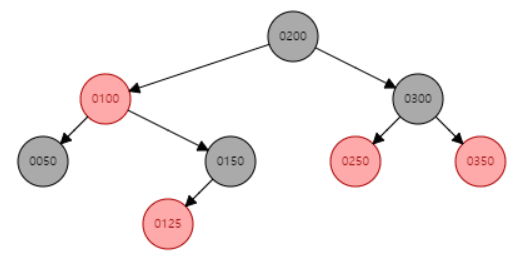|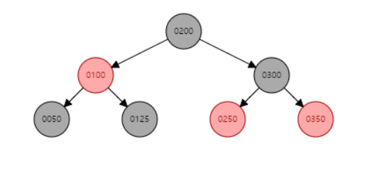

기본적으로 대체되는 노드의 색상이 블랙으로 변경되는 것은  
삭제 연산의 기본적으로 처리되는 과정이다.  
이 경우에는 속성의 위반이 일어나지 않았지만,  
다음의 경우에는 블랙으로 변경되는 처리과정이 속성의 위반을 일으킨다.

2. 삭제된 노드를 대체하는 노드가 블랙인 경우  

이 경우에는 레드와는 다르게 경우가 복잡해진다.  
대체하려는 노드는 기본적으로 블랙으로 변경된다.  
그러나, 삭제되는 노드도 블랙이라면 대체 노드는 이중흑색노드가 된다.  

이 경우에는 레드 노드가 연속되지는 않지만,  
루트에서 각각의 NIL 노드까지의 거리, 즉 black height가 제각기 달라지게 된다.  
이 경우에는 루트에서 NIL 노드까지 거치는 블랙 노드의 수가 모두 같다는 속성을 위반하게 된다.

이 경우에는 삭제된 노드의 문제가 아니라,  
대체된 노드와 그 부모, 형제 노드의 관계에 따라 처리방식의 차이가 발생하게 된다.

######이증 흑색노드 처리

C1. 이중흑색노드의 형제가 레드인 경우  
형제를 블랙, 부모를 레드로 칠하고, 부모노드를 기준으로 좌회전한다.

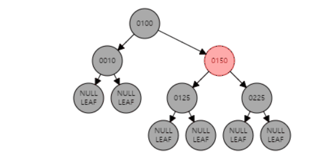  
위의 과정이 이루어진 다음에도  
NIL 노드가 아직 이중흑색노드로 남아있고, 형제가 레드가 아닌 블랙인 경우로 바뀌었다.

이 이후에는 다음에 나올 case에 따라 처리하면 된다.  

Ca. 이중흑색노드의 형제가 블랙이고, 형제의 양쪽 자식 모두 블랙인 경우,  

형제노드만 레드로 만들고, 이중흑색노드의 블랙 1개를 부모에게 전달하다.

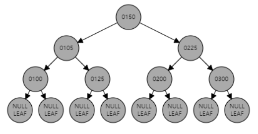  
다음 과정을 나누어서 서술하자면,

a. 삭제하려는 노드가 100인 경우, 그 자리를 대체하는 것은 NIL 노드이다.  
b. NIL 노드가 이중흑색노드가 되었고, 이중흑색노드의 형제 125도 블랙이고, 그 자식도 블랙이다.  
c. 형제만 레드로 만들고, 이중흑색노드의 블랙을 부모에게 전달한다.  
-> 부모가 레드였다면, 블랙으로 칠하고 종료, 지금은 부모가 블랙인 경우라 이중흑색노드가 되었음.   
-> 지금의 경우에는, 다시 이 case의 반복이다.  
-> 105의 부모에게 이중흑색노드의 블랙을 부모 150에 전달하고, 그 형제 225를 레드로 만든다.  
-> 결과적으로 이중흑색노드가 해소되고, 레드블랙트리의 특성에 부합된다.  

Cb. 이중흑색노드의 형제가 블랙이고, 형제의 왼쪽 자식이 레드, 오른쪽 자식이 블랙인 경우  

형제노드를 레드로, 형제노드의 왼쪽 자식을 블랙으로 칠한 다음,  
형제노드를 기준으로 우회전 한다.

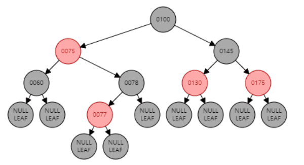  
다음 과정을 나누어서 서술하자면,

a. 삭제하려는 노드가 60인 경우, 그 자리를 대체하는 것은 NIL 노드이다.  
b. NIL 노드가 이중흑색노드가 되었고, 이중흑색노드의 형제의 왼쪽자식이 레드, 오른쪽 자식이 블랙이다.  
c. 형제노드인 78을 레드로 만들고, 형제노드의 왼쪽자식을 블랙으로 만든다.  
d. 형제노드를 기준으로 우회전한다.  
-> 이 경우 이중흑색노드가 해결되지 않는다. 이 다음 과정은 Case c에서 처리한다.  

Cc. 이중흑색노드의 형제가 블랙이고, 형제의 오른쪽 자식이 레드인 경우  

부모노드의 색을 형제에게 넘긴다. 부모노드와 형제노드의 오른쪽 자식을 검은색으로 칠한다.  
부모노드 기준으로 좌회전한다.

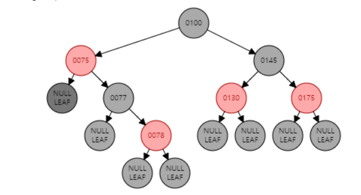  
이전 Case에 이어서 서술하자면,  

a. 이중흑색노드인 제일 좌측에 존재하는 NIL 노드의 부모노드를 기준으로 왼쪽 회전을 실시한다.  
b. 부모노드의 색을 형제노드로 넘긴다. 즉 형제노드의 색을 레드로 칠한다.  
c. 부모노드와 형제노드의 오른쪽 자식을 블랙으로 칠한다.  

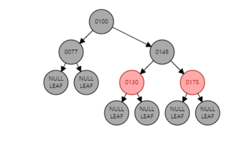  
이와 다른 경우에는 다음과 같다.

a. 삭제하려는 노드가 77인 경우, 그 자리를 대체하는 것은 NIL 노드이다.  
b. NIL 노드의 부모노드, 즉 100 노드를 기준으로 좌회전을 실시한다.  
c. 부모 100의 색을 형제노드로 넘긴다. 즉 형제노드를 블랙으로 칠한다.  
d. 마지막으로 부모노드와 형제노드의 오른쪽 자식을 블랙으로 칠한다.  
