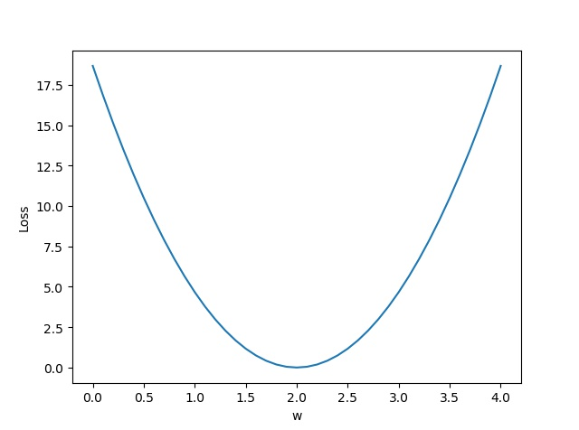

### Linear Model (선형 모형)

선형 모형은 일반적으로 Supervised Learning에 속하며, 따라서 labeled data가 필요하다.  
일반적으로 $x$가 존재하면, 그에 따른 $y$값을 학습하여, $y$값을 모르는 $x$값이 주어졌을 때, $y$값을 예측할 때 사용된다.  

예를 들어 공부시간과 시험 성적에 대해 이야기를 하면, 공부 시간이 늘어나면 시험 성적이 높아질 것이라는 생각이 가능하다.  
이러한 관계는 기본적으로 선형 관계라고 볼 수 있다. 이러한 예 말고도 많은 경우에도 적용이 가능하다.

주로 선형 모형은 다음과 같은 방정식으로 표현이 된다.

<p>$$ \hat y = x * w + b $$</p>

위의 방정식에서 $x$의 역할은 입력이며, $\hat y$는 모델을 통해 예측된 $y$의 값이다.  
또 $w$는 선형 모델에서의 변수 (다르게는 기울기), $b$는 편차(bias) (다르게는 절편)이다.

우리는 가지고 있는 $x$와 $y$ 데이터를 가지고, 실제 데이터에 적합한 선을 만들어야 한다.  
데이터에 적합한 선형 모델을 만들기 위해서 $w$와 $b$에 random한 value를 넣고 평가를 실시하게 된다.

여기서 $b$까지 이야기하는 것은 힘들기 때문에, 방정식을 단순화하여 $\hat y = x * w$로 설명하자.  
$b$가 모두 같다고 가정하고, $w$만 달라지기 때문에 실제 데이터 값과의 차이를 통해 $w$를 맞춰 나간다.

실제 데이터 값과 예측 값과의 차이를 $y - \hat y$로 표현할 수 있는데,  
이 차이는 양수, 음수 모두 가능하기 때문에 이를 제곱한 값인 $(y - \hat y)^2$, 즉 오차(Error)를 가지고 모형을 fitting하게 된다.

이를 다시 말하면,  
Training Loss(or Error, 학습 손실)이라고 한다.

<p>$$ loss = (\hat y - y)^2 = (x * w - y)^2 $$</p>

아래의 표를 보고 Loss에 대해 이해해보자.  

| Hour, X | Points, y | Prediction, $\hat y (w = 3)$ | Loss $(w = 3)$ |
|:-------:|:---------:|:----------------------------:|:--------------:|
|    1    |     2     |              3               |  $(3-2)^2 = 1$ |
|    2    |     4     |              6               |  $(6-4)^2 = 4$ |
|    3    |     6     |              9               |  $(9-6)^2 = 9$ |
|         |           |                              |  mean = 14 / 3 |

| Hour, X | Points, y | Prediction, $\hat y (w = 4)$ | Loss $(w = 4)$ |
|:-------:|:---------:|:----------------------------:|:--------------:|
|    1    |     2     |              4               | $(4-2)^2 = 4$  |
|    2    |     4     |              8               | $(8-4)^2 = 16$ |
|    3    |     6     |              12              | $(12-6)^2 = 36$|
|         |           |                              |  mean = 56 / 3 |

| Hour, X | Points, y | Prediction, $\hat y (w = 2)$ | Loss $(w = 2)$ |
|:-------:|:---------:|:----------------------------:|:--------------:|
|    1    |     2     |              2               |  $(2-2)^2 = 0$ |
|    2    |     4     |              4               |  $(4-4)^2 = 0$ |
|    3    |     6     |              6               |  $(6-6)^2 = 0$ |
|         |           |                              |  mean = 0      |

보다시피 $w$의 값이 변화할 때, Loss function의 값이 변화하게 되는데  
위의 경우에는 $w = 2$인 경우에 Loss가 0이 되어 정확한 모델이 형성된다고 볼 수 있다. 

표에서 mean이라고 표현된 부분은 평균제곱오차(MSE, Mean Square Error)라고 부르는데,  
말 그대로 오차 제곱합의 평균이라는 뜻이다.  

각 개별 데이터 별의 오차, 손실은 $ loss = (\hat y - y)^2 = (x * w - y)^2 $로 표시되지만,  
학습한 모든 데이터에 대한 손실은 다음과 같이 나타낸다.

<p>$$ loss = {1\over N}\sum_{n=1}^N (\hat y_n - y_n)^2 $$</p>

머신러닝은 MSE를 최소화하는 $w$값을 자동으로 찾는 것이다.  
위의 경우에 $w$값이 x축, MSE를 y축으로 하는 그래프를 그리면,  
$w=2$에서 0이고 대칭인 이차 함수 그래프가 그려진다.  



다음 lecture에서 배울 점진적 하강법(Gradient Descent Algorithm)을 사용하여,  
loss를 최소화하는 것을 찾아나가게 나간다.

이를 파이썬 함수로 구현하면 다음과 같다.  
```python
w = 1.0 # random value
def forward(x):
    return x * w

def loss(x, y):
    y_pred = forward(x)
    return (y_pred - y) * (y_pred - y)
```
